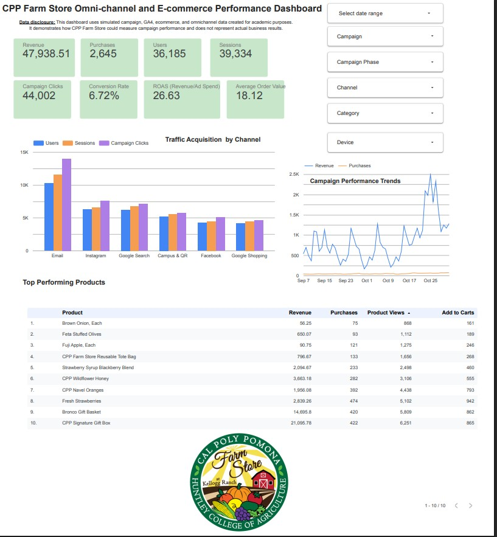

# Looker Studio Dashboard

-   Dashboard link

    <https://datastudio.google.com/reporting/15138c91-e450-498f-b0ee-00d998b28f20>

-   Screenshot:

    

# Data source

-   [Simulated Campaign Performance Data Source](https://docs.google.com/spreadsheets/d/1VGpNvBcBvh3cdmXxKpXOL_6eN2AIgGyc39b_xcC3XsE/edit?usp=sharing)

# Explanation of KPIs

The dashboard will focus on seven KPIs that connect directly to the goals of the *Fresh from Our Farm to Your Campus* campaign.

### Users

`Users` represent the number of people who visit the CPP Farm Store website during the campaign. This KPI will help determine whether Google Search, Google Shopping, social media, email, and campus promotions are successfully increasing awareness of the Farm Store.

### Product Page Views

`Product page views` measure how often customers view specific products on the Shopify website. This will help identify which products generate the most interest, particularly the CPP Signature Gift Box, Bronco Gift Basket, seasonal produce, and specialty foods.

### Add-to-Cart Events

`Add-to-cart events` measure how many customers place a product in their online shopping cart. This represents stronger purchase interest than simply viewing a product and can help identify products customers seriously consider buying.

### Purchases

`Purchases` represent completed simulated ecommerce orders. This KPI will show whether the campaign and Shopify website successfully turn customer interest into actual sales.

### Conversion Rate

`Conversion rate` measures how effectively website visits result in completed purchases. It will help the Farm Store determine whether customers can easily move from product discovery through checkout or whether improvements to the website and ordering process are needed.

### Store Pickup Orders

`Store pickup orders` measure the number of customers who complete an online order and select in-store pickup. This is especially important because the campaign is designed to connect online product discovery with visits to the physical CPP Farm Store.

### Revenue

`Revenue` measures the total simulated sales generated during the campaign. It will help determine which products and marketing channels contribute the most financial value and whether the campaign supports the Farm Store’s ecommerce goals.

# Short interpretation of dashboard insights

CPP Farm Store’s simulated campaign generated 36,185 users, 39,334 sessions, and 44,002 campaign clicks. These activities resulted in 2,645 purchases and \$47,938.51 in revenue. The campaign achieved a 6.72% conversion rate, an average order value of \$18.12, and a return on advertising spend of 26.63. These results suggest that the simulated campaign successfully attracted qualified traffic and converted visitors into customers, demonstrating strong overall marketing performance and an efficient use of advertising resources.

Email was the strongest acquisition channel based on users, sessions, and campaign clicks. Instagram and Google Search formed the second tier of acquisition channels, while Facebook and Google Shopping generated lower traffic volumes. This suggests that email marketing should remain a priority channel, while Facebook and Google Shopping may benefit from improved audience targeting, updated creative content, or additional promotional testing to increase engagement.

CPP Signature Gift Box was the leading product, generating \$21,095.78 in revenue from 422 purchases. Bronco Gift Basket ranked second with \$14,695.80 from 420 purchases. Together, these two products produced approximately 74.66% of total revenue, showing that gift oriented products were the campaign’s main revenue drivers. The strong performance of these gift bundles suggests that they should continue to be featured in seasonal promotions, holiday campaigns, and homepage highlights to maximize revenue opportunities.

Across the product catalog, 32,115 product views produced 5,341 add to cart actions and 2,645 purchases. Approximately 16.63% of product views resulted in an add to cart action, while 49.52% of add to cart actions resulted in a purchase. The largest opportunity therefore occurs between viewing a product and adding it to the shopping cart. Improving product descriptions, images, pricing visibility, and calls to action could encourage more visitors to add products to their carts and increase overall conversions.

# Recommended actions based on the dashboard

1)  Continue investing in email marketing as the primary acquisition and retention channel, since it generated the highest number of users, sessions, and campaign clicks. Compare its revenue and conversion rate with paid channels to identify the most cost-effective marketing mix.

2)  Prioritize high-performing products, including the CPP Signature Gift Box and Bronco Gift Basket, in seasonal promotions, holiday campaigns, email marketing, and homepage features. Together, these products generated nearly 75% of simulated revenue, making them key drivers of sales.

3)  Optimize product pages to reduce the drop-off between product views and add-to-cart actions. Improvements such as higher-quality images, clearer product descriptions, stronger calls to action, customer reviews, and limited-time promotions could encourage more shoppers to begin the purchase process.

4)  Increase the average order value by introducing cross-selling and product bundle recommendations. Suggest complementary products during checkout or on product pages to encourage customers purchasing gift boxes or baskets to add specialty foods, fresh produce, or Farm Store merchandise.

5)  Analyze the revenue increase observed at the end of the campaign period by using the dashboard filters (campaign, campaign phase, channel, category, and device). Identifying the factors that contributed to this growth can help replicate successful strategies in future campaigns.

6)  Validate these findings using real GA4 and Shopify data before making long-term marketing or merchandising decisions. Because this dashboard is based on simulated data, ongoing analysis with actual customer behavior will provide more accurate insights and support continuous optimization.

# Appendix

-   [GitHub Repo](https://github.com/lewiswaddell/GP6.git)

-   [GitHub Page](https://lewiswaddell.github.io/GP6/)
